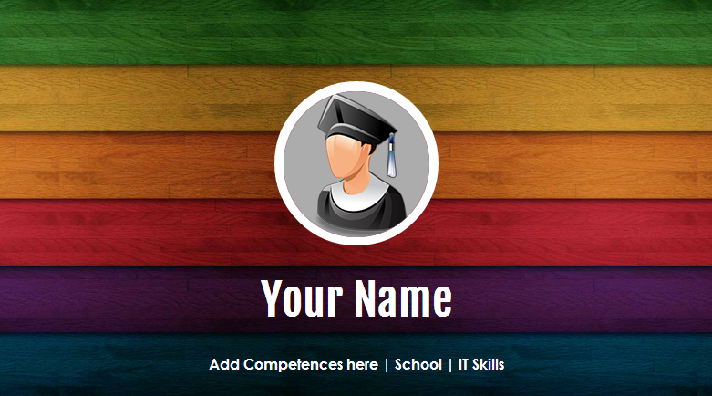

Personal Web Page
================

A responsive web page only in HTML5 and CSS3.
 
All the smooth animation are full CSS3.
I created a style-mobile.css a style-tablet.css and a style-desktop.css in this repository
 
###Preview:

  

